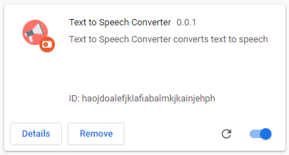
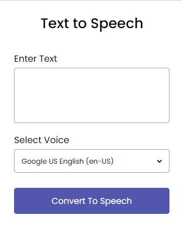

# Text to Speech Converter Chrome Extension

> Text to Speech Chrome Extension converts given Text to Speech.

#### Screenshot

## Built With

* JavaScript 

## Run Locally 

* To install the extension just download zip, unpack it, then:

1. Open the Extension Management page by navigating to chrome://extensions.

   a) Alternatively, open this page by clicking on the Extensions menu button and selecting Manage Extensions at the bottom of the menu.
   
   b) Alternatively, open this page by clicking on the Chrome menu, hovering over More Tools then selecting Extensions
 2. Enable Developer Mode by clicking the toggle switch next to Developer mode.
 3. Click the Load unpacked button and select the extension directory.
